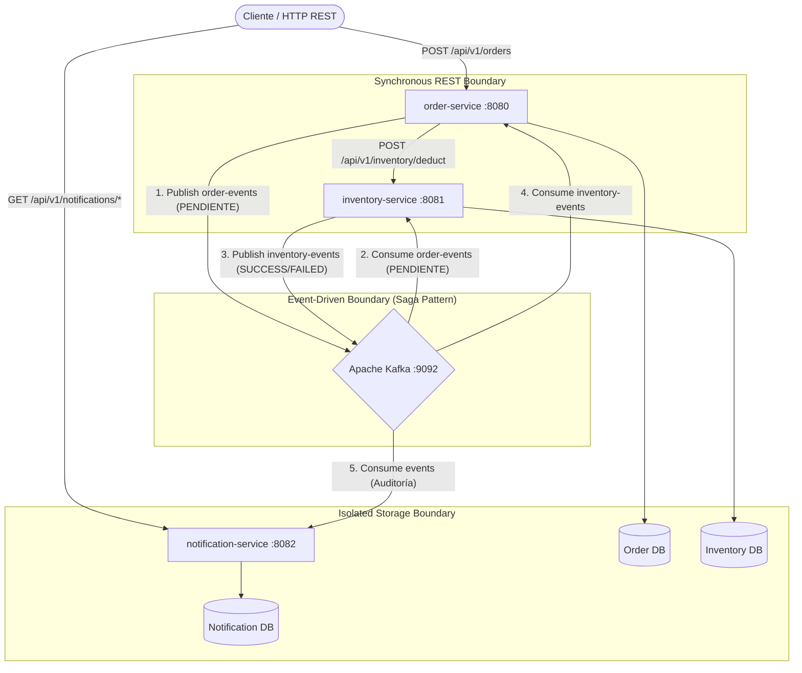
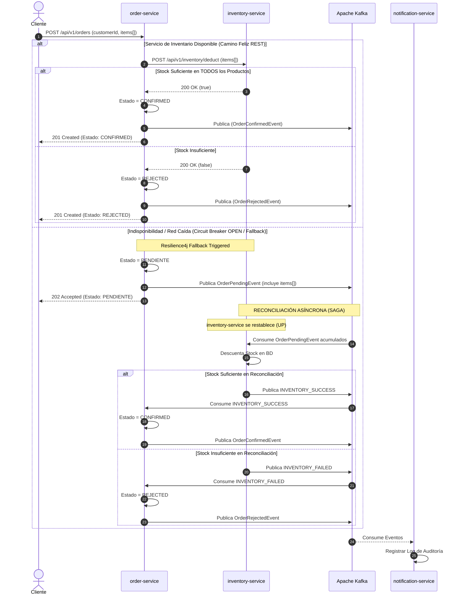
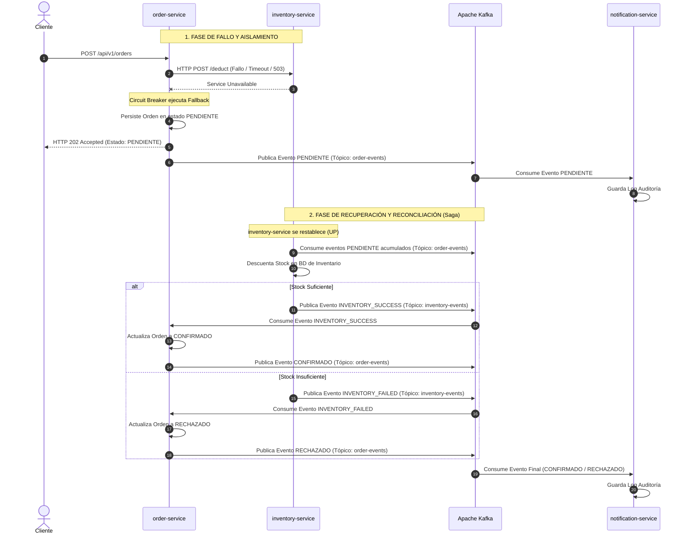
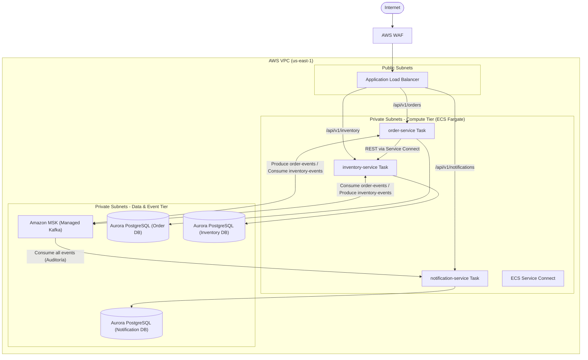
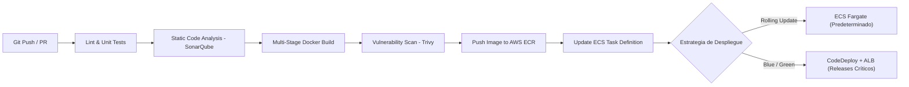

# Arquitectura del Sistema de Gestión de Pedidos e Inventario

## 1. Visión General y Estrategia de Migración
Este sistema representa la primera fase de modernización del monolito logístico hacia una arquitectura orientada a microservicios desacoplados. Se implementa el patrón **Database per Service**, para garantizar la autonomía de los datos y un enfoque híbrido de comunicación (Síncrono REST para validaciones críticas y Asíncrono **Event-Driven Architecture (EDA)** mediante Kafka para notificaciones y resiliencia) y llamadas atómicas síncronas bajo la filosofía **Domain-Driven Design (DDD)**.

---

## 2. Decisiones Clave de Dominio y Diseño

1. **Natural Key vs. Surrogate Key:**
   * **`productCode` (SKU):** Utilizado exclusivamente como identificador de negocio en contratos de API, DTOs y mensajes de Kafka para evitar el acoplamiento a secuencias internas.
   * **`id` (Long):** Restringido al uso técnico de base de datos como clave primaria relacional (*Surrogate Key*).

2. **Procesamiento Batch Atómico (All-or-Nothing):**
   * La creación de órdenes admite múltiples productos por solicitud.
   * `inventory-service` procesa la lista de ítems en una única transacción: si algún ítem no posee stock suficiente, la transacción ejecuta un *rollback* completo y la orden se marca como `RECHAZADO`.

3. **Resiliencia y Fallback:**
   * Las peticiones síncronas entre `order-service` e `inventory-service` están protegidas por **Resilience4j**.
   * Al abrirse el circuito, se guarda el estado como `PENDIENTE` y se emite un evento a Kafka para su posterior reconciliación asíncrona.

---

## 3. Diagramas Lógicos y de Secuencia

### 3.1. Arquitectura Lógica Local (Docker Compose)

---

### 3.2. Diagrama de Secuencia: Flujo "Crear Pedido" con Tolerancia a Fallos

---

### 3.3. Garantía de Consistencia y Manejo de Fallos Parciales (Saga Coreografiada Híbrida)

Para garantizar la consistencia entre `order-service` e `inventory-service` bajo la filosofía de **Consistencia Eventual** (*Eventual Consistency*), el sistema combina comunicación síncrona REST para el tráfico habitual y un patrón **Saga por Coreografía Híbrida** respaldado por Apache Kafka para la resiliencia ante caídas del servicio de inventario.

#### Diagrama de Secuencia: Reconciliación Asíncrona vía Saga

---

## 4. Despliegue Target en la Nube (AWS Architecture)

### 4.1. Diagrama Cloud (AWS VPC)

---

### 4.2. Especificación Detallada de Componentes AWS & Criterios de Selección

#### A. Cómputo y Orquestación: AWS ECS Fargate
* **Criterio de Selección:** Se elige **AWS ECS Fargate** sobre EKS (Kubernetes) para eliminar la sobrecarga operacional de administrar el plano de control y los nodos *worker*. Ofrece aislamiento a nivel de kernel por contenedor y cobro por segundo exacto de consumo (vCPU y Memoria).
* **Políticas de Auto Scaling:** Escalado horizontal (*Target Tracking*) configurado para responder dinámicamente a la carga:
  * Utilización media de CPU > 70%.
  * Utilización media de Memoria > 80%.
  * Concurrencia en Application Load Balancer > 1,000 peticiones por minuto por réplica.
* **Task Definitions:** Diseñadas bajo el principio de mínimo privilegio, asignando roles IAM específicos por tarea (`Task Role`) y roles de ejecución para descarga de imágenes de ECR e inyección de logs (`Task Execution Role`).

#### B. Comunicaciones Internas: ECS Service Connect
* **Mecanismo:** Utiliza proxys Envoy de alto rendimiento ejecutados como *sidecars* para gestionar el tráfico Este-Oeste entre microservicios (`order-service` $\rightarrow$ `inventory-service`).
* **Beneficios:**
  * **Descubrimiento de Servicios:** Resolución DNS privada nativa (ej. `http://inventory-service.orderinvent.internal:8081`).
  * **Resiliencia L7:** Balanceo de carga en capa de aplicación con reintentos automáticos, retardo de conexiones e interrupción de circuito a nivel de red.
  * **Telemetría Nivel Red:** Generación automática de métricas de latencia y errores de red sin alterar el código Java/Spring Boot.

#### C. Persistencia Aislada: Amazon Aurora PostgreSQL Serverless v2
* **Criterio de Selección:** Garantiza el cumplimiento del patrón *Database per Service* con auto-escalado instantáneo, ajustándose automáticamente al volumen de transacciones por segundo (TPS).
* **Alta Disponibilidad:** Despliegue Multi-AZ con réplicas de lectura de baja latencia y conmutación por error (*failover*) automática.
* **Seguridad y Red:** Ubicadas exclusivamente en subredes privadas aisladas de datos (`Isolated Data Subnets`), inaccesibles desde Internet y con reglas de *Security Groups* que solo permiten tráfico entrante desde las Tareas ECS correspondientes.

#### D. Bus de Eventos: Amazon MSK (Managed Streaming for Apache Kafka)
* **Configuración:** Clúster administrado desplegado en 3 Zonas de Disponibilidad (Multi-AZ) para asegurar cero pérdida de eventos (*Replication Factor = 3*, *min.insync.replicas = 2*).
* **Tópicos Administrados (Saga Coreografiada):**
  * `order-events`: Emisión de eventos del ciclo de vida del pedido (`PENDIENTE`, `CONFIRMADO`, `RECHAZADO`). Particionado por `orderId` para garantizar ordenamiento estricto.
  * `inventory-events`: Respuestas asíncronas de la Saga emitidas por `inventory-service` (`INVENTORY_SUCCESS`, `INVENTORY_FAILED`) tras procesar descuentos diferidos.
* **Estrategia de Resiliencia:** Descuento de stock en lote (*All-or-Nothing*) y replayability mediante offsets de Kafka para procesar transacciones acumuladas tras periodos de indisponibilidad.
* **Monitoreo de Lag:** Control continuo del *Consumer Group Lag* en `inventory-service`, `order-service` y `notification-service` para detectar cuellos de botella mediante Prometheus/CloudWatch.

#### E. Seguridad de Red e Infraestructura
* **AWS WAF (Web Application Firewall):** Inspección de tráfico web entrante en el Load Balancer para mitigar ataques OWASP Top 10, SQLi, XSS y aplicar *Rate Limiting*.
* **Application Load Balancer (ALB):** Punto de entrada público en `Public Subnets`. Ejecuta la terminación TLS/SSL (Certificados administrados con AWS Certificate Manager) y enruta el tráfico hacia las subredes privadas.
* **AWS Secrets Manager & KMS:** Cifrado en reposo y en tránsito (TLS 1.3). Las credenciales de bases de datos y secretos de Kafka se inyectan dinámicamente como variables de entorno al iniciar cada Tarea ECS.

---

## 5. Pipeline de CI/CD y Estrategia de Despliegue

### 5.1. Flujo del Pipeline (GitHub Actions + AWS ECR / ECS)

### 5.2. Justificación Tecnológica de Herramientas

-   ****GitHub Actions (CI/CD Runner):**** Se selecciona por su integración nativa con el repositorio de código, la capacidad de ejecutar flujos paralelos por microservicio mediante __Matrix Builds__ y su soporte nativo para `aws-actions` oficiales. Permite gestionar __Workflows__ reutilizables para `order-service`, `inventory-service` y `notification-service`.
-   ****Amazon ECR (Elastic Container Registry):**** Registro privado de imágenes Docker en AWS con escaneo automático de vulnerabilidades (__Scan on Push__) cifrado con AWS KMS y políticas de ciclo de vida (__Lifecycle Policies__) para depurar automáticamente imágenes antiguas de staging/dev.
-   ****AWS ECS Fargate & CodeDeploy (CD Execution):**** Orquestación del despliegue en subredes privadas, delegando a CodeDeploy la gestión avanzada de tráfico mediante balanceador de carga (ALB).

---
### 5.3. Estrategia Resiliencia en Despliegue

Para esta arquitectura se adopta un ****enfoque híbrido adaptativo****, utilizando ****Rolling Update**** como estrategia principal predeterminada y ****Blue/Green**** para versiones mayores.

#### A. Configuración de Rolling Update (Estrategia Predeterminada)

Configurada nativamente en ECS Fargate mediante las siguientes variables de control de capacidad:

-   **`**minimumHealthyPercent = 100**`******:**** Garantiza que la capacidad contratada nunca baje del 100% durante el despliegue, previniendo degradaciones de servicio ante picos de tráfico.
-   **`**maximumPercent = 200**`******:**** Permite a ECS duplicar temporalmente las Tareas para levantar la versión nueva antes de desaprovisionar la versión anterior.

#### B. Configuración de Blue/Green Deployment (Releases Críticos / Major)

Orquestada mediante ****AWS CodeDeploy**** y reglas del ****Application Load Balancer (ALB)**** para cambios estructurales de API o esquema:

-   ****Target Groups Duales:**** Se mantienen dos Target Groups en el ALB (`TG-Blue` activo y `TG-Green` de staging).
-   ****Conmutación Instantánea (Cutover):**** La nueva versión se despliega de forma aislada en `TG-Green`. Tras ejecutar pruebas de humo automatizadas en un puerto de prueba, CodeDeploy conmuta el 100% del tráfico de producción en menos de 1 segundo.
-   ****Periodo de Retención (****_****Baking Time****_****):**** El entorno __Blue__ se mantiene activo en reserva durante 30 minutos post-despliegue, permitiendo un __Rollback__ instantáneo de 1-click si las métricas de negocio o error se degradan.

#### C. Mecanismos de Verificación y Tolerancia a Fallos durante el Despliegue

1.  ****Detección de Salud Basada en Actuator (******`**Readiness Probes**`******):****
    -   El Application Load Balancer redirige tráfico a una nueva Tarea ECS ****únicamente cuando el endpoint**** **`**/actuator/health/readiness**`** ****responda**** **`**200 OK**`**.
    -   Esto asegura que las conexiones a PostgreSQL (Aurora) y la suscripción a los tópicos de Kafka (MSK) estén totalmente inicializadas antes de recibir peticiones de clientes.
2.  ****ECS Deployment Circuit Breaker:****
    -   Se activa la funcionalidad nativa `deploymentCircuitBreaker: { enable: true, rollback: true }`.
    -   Si las nuevas tareas fallan consecutivamente los __Health Checks__ del Application Load Balancer durante la fase de lanzamiento, el despliegue se detiene automáticamente, elimina los contenedores defectuosos y restablece el servicio a la versión anterior estable sin intervención manual.
---

## 6. Decisiones de Arquitectura (ADRs)

### ADR 001: Patrón Database per Service
* **Contexto:** Se requiere desacoplar el monolito logístico para permitir que el módulo de pedidos e inventario escalen de forma independiente.
* **Decisión:** Cada microservicio gestiona su propia base de datos de manera aislada. Se prohíben accesos directos o consultas cruzadas a nivel de BD.
* **Consecuencias:** Garantiza autonomía de despliegue y evita acoplamiento de esquema. Requiere el uso de APIs REST e integración orientada a eventos (EDA) para consistencia eventual.

### ADR 002: Manejo de Resiliencia mediante Circuit Breaker
* **Contexto:** La validación de inventario al crear una orden es una llamada síncrona propensa a fallar si `inventory-service` experimenta latencia o caídas.
* **Decisión:** Integración de Resilience4j en `order-service`. Ante una interrupción del servicio de inventario, la orden se guarda en estado `PENDIENTE` y se emite un evento a Kafka para garantizar tolerancia a fallos.
* **Consecuencias:** Evita fallos en cascada, protegiendo los hilos del servidor y garantizando que la orden del cliente no se pierda.

### ADR 003: Estandarización del Código SKU (`productCode`)
* **Contexto:** Exponer identificadores primarios autogenerados por la base de datos (`id: Long`) genera acoplamiento a la persistencia interna y ambigüedades en sistemas distribuidos.
* **Decisión:** La comunicación externa e inter-servicio se realiza mediante la clave de negocio `productCode` (String). El ID numérico se oculta en la capa de infraestructura interna.
* **Consecuencias:** Mejora la semántica de dominio (DDD) y desacopla las APIs externas de la estrategia de claves primarias internas.

### ADR 004: Procesamiento Batch y Verificación Atómica
* **Contexto:** Un pedido puede incluir múltiples productos. Descontar parcialmente el stock de un pedido cuando otro producto no tiene existencias genera datos inconsistentes y problemas logísticos.
* **Decisión:** `inventory-service` expone una interfaz de descuento en lote que evalúa la totalidad del pedido bajo el principio *All-or-Nothing*.
* **Consecuencias:** Previene descuentos parciales e inconsistencias logísticas sin añadir la sobrecarga de transacciones distribuidas complejas.

### ADR 005: Selección de AWS ECS Fargate frente a Kubernetes (EKS)
* **Contexto:** Evaluación de la plataforma de orquestación de contenedores en AWS para equilibrar flexibilidad, costo y complejidad operativa.
* **Decisión:** Seleccionar AWS ECS Fargate para el cómputo de la plataforma.
* **Consecuencias:** Elimina la complejidad operativa de administrar nodos Kubernetes o clústeres EC2, reduciendo el costo total de propiedad.

### ADR 006: Saga Coreografiada Híbrida para Reconciliación Asíncrona
* **Contexto:** Cuando `inventory-service` está caído, el Fallback de Circuit Breaker en `order-service` asigna el estado `PENDIENTE`. Sin un mecanismo de reconciliación, las órdenes quedan en un estado huérfano de forma permanente.
* **Decisión:** Implementar una Saga por Coreografía utilizando Apache Kafka como bus de eventos duradero. `inventory-service` consume eventos en estado `PENDIENTE` al reiniciar, procesa el descuento de stock diferido y responde vía el tópico `inventory-events` para que `order-service` actualice el estado final (`CONFIRMADO` o `RECHAZADO`).
* **Consecuencias:** Se garantiza la consistencia eventual sin acoplamiento síncrono ni bloqueos de transacciones cruzadas. Permite a `notification-service` registrar la trazabilidad histórica completa del pedido.

---

## 7. Observabilidad y Trazabilidad Distribuida

* **Micrometer Tracing:** Inyección automática de variables `traceId` y `spanId` en la cabecera de las peticiones HTTP y metadatos de Kafka para correlacionar logs a través de múltiples microservicios (propagación W3C Standard e integración con AWS X-Ray).
* **Prometheus Endpoint:** Exposición del endpoint `/actuator/prometheus` en cada microservicio para la recolección de métricas operativas por Prometheus y visualización en Grafana o CloudWatch.
* **Probes de Salud:** Separación de endpoints de diagnóstico (`/actuator/health/liveness` para reinicio del contenedor y `/actuator/health/readiness` para recepción de tráfico) alineados con las políticas de chequeo del Load Balancer (ALB).
* **Logging Estructurado en JSON:** Salida estándar de logs en formato JSON estructurado utilizando `logback-json-encoder` para ingesta directa en AWS CloudWatch Logs Insights.

---

## 8. Estimación de Costos y Palancas de Optimización

### 8.1. Componentes que Concentran el Mayor Costo

1.  ****Amazon MSK (Managed Kafka):**** Representa el mayor costo fijo. Al desplegar un clúster de Kafka administrado en múltiples Zonas de Disponibilidad (Multi-AZ) para garantizar cero pérdida de eventos en el patrón Saga, se paga por nodos dedicados y almacenamiento persistente encendidos 24/7.
2.  ****Amazon Aurora Serverless v2:**** Es el segundo componente en impacto. Mantener tres bases de datos relacionales independientes para cumplir con el patrón __Database per Service__ implica pagar el mínimo de capacidad y almacenamiento distribuido por triplicado.
3.  ****Tráfico de Red y NAT Gateways:**** La comunicación privada entre subredes y la salida hacia servicios de AWS o Internet genera cobros por hora por gateway más el volumen de datos procesados.

### 8.2. Palancas de Optimización

Para maximizar el retorno de inversión sin comprometer la resiliencia del sistema, se definen las siguientes estrategias:

-   ****Para el Cómputo (ECS Fargate):****
-   -   ****Fargate Spot:**** Combinar tareas estándar con tareas __Spot__ para el auto-escalado horizontal en picos de tráfico.
    -   ****Compute Savings Plans:**** Aplicar compromisos de uso a 1 o 3 años para el tráfico base estimado.
-   ****Para la Capa de Eventos (Kafka):****
-   -   ****MSK Serverless en No-Producción:**** En ambientes de desarrollo y pruebas (QA), reemplazar el clúster dedicado de MSK por ****MSK Serverless****, pagando únicamente por los eventos transmitidos y reduciendo el costo de eventos en dev/test.
-   ****Para la Capa de Datos (Aurora):****
-   -   ****Consolidación Logística en Desarrollo:**** En entornos locales o de desarrollo, consolidar las bases de datos en una sola instancia de Aurora (separadas por esquemas), manteniendo la separación en instancias físicas independientes únicamente para Producción.
    -   ****Límites de Escalado:**** Configurar topes máximos en Aurora Serverless v2 para evitar costos descontrolados ante picos anómalos de consultas.
-   ****Para la Red (Networking):****
-   -   ****AWS PrivateLink (VPC Endpoints):**** Conectar los microservicios en Fargate directamente con AWS ECR, Secrets Manager y CloudWatch a través de la red interna de AWS, eliminando el tráfico por NAT Gateway y reduciendo sustancialmente el costo por transferencia de datos.