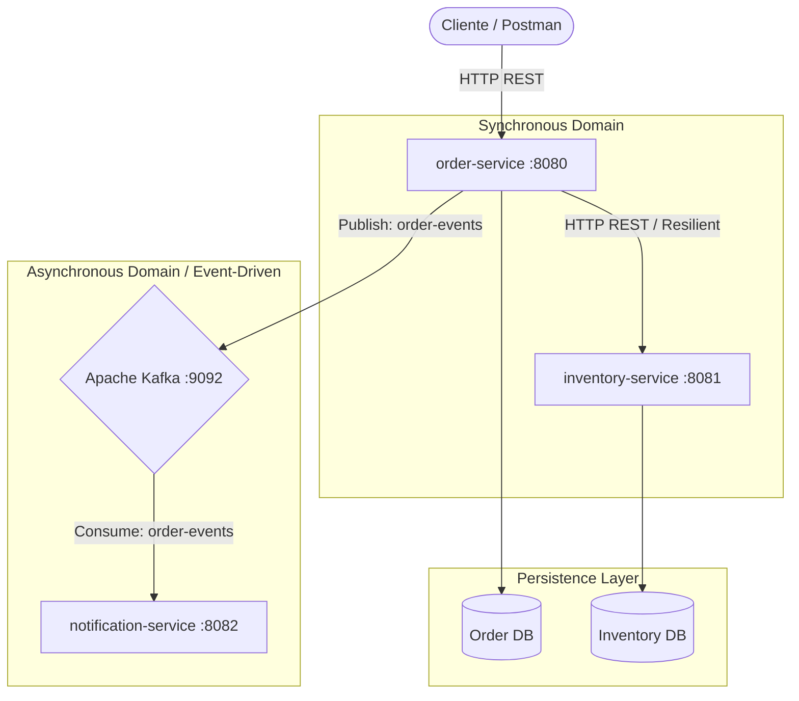
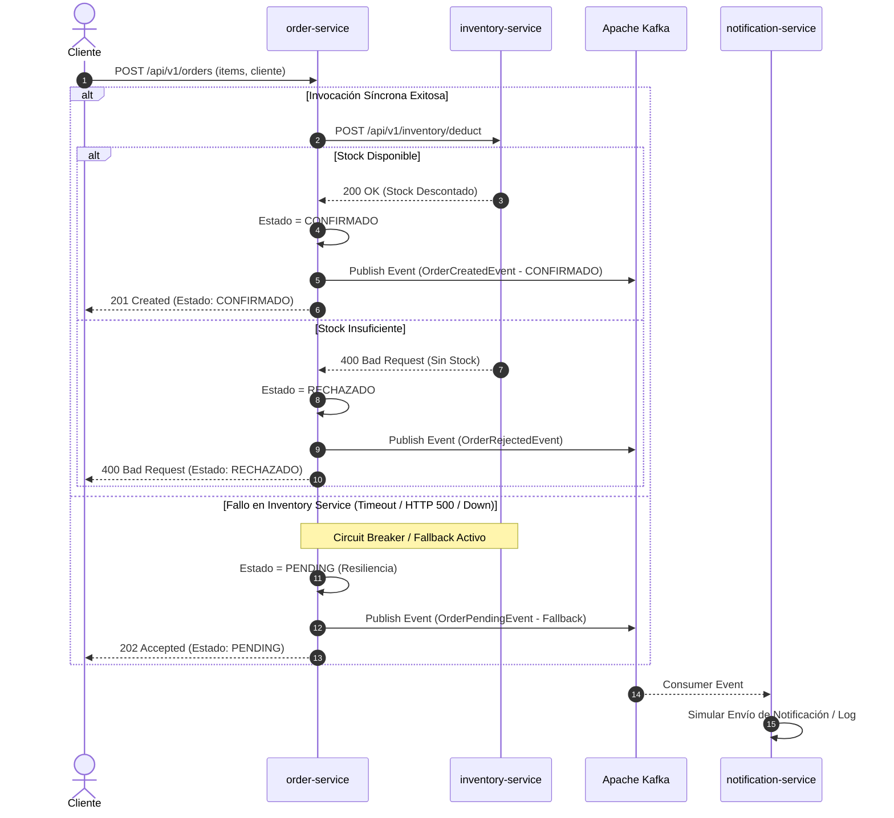

# Arquitectura del Sistema de Gestión de Pedidos e Inventario

## 1. Visión General y Estrategia de Migración
Este sistema representa la primera fase de modernización del monolito logístico hacia una arquitectura orientada a microservicios desacoplados. Se implementa el patrón **Database per Service** para garantizar la autonomía de los datos y un enfoque híbrido de comunicación (Síncrono REST para validaciones críticas y Asíncrono EDA mediante Kafka para notificaciones y resiliencia).

---

## 2. Diagrama de Arquitectura Lógica (Entorno Local)



---

## 3. Diagrama de Secuencia: Flujo "Crear Pedido" con Tolerancia a Fallos



---

## 4. Estrategia de Consistencia Evidentemente Eventual
Para garantizar la consistencia entre `order-service` e `inventory-service` sin bloquear transacciones en un entorno distribuido:
* **Escenario Normal:** Se utiliza una transacción local ACID dentro de `inventory-service` para verificar y descontar stock atómicamente.
* **Escenario de Fallo Parcial:** Cuando `inventory-service` está fuera de línea, `order-service` entra en estado `PENDING` a través del Circuit Breaker y publica el evento en Kafka. Un proceso consumidor/reconciliador posterior (Patrón Saga Orquestada / Outbox) reintenta el descuento de stock una vez restablecido el servicio.

---

## 5. Diseño de Despliegue en AWS (Producción)

### Diagrama de Arquitectura Cloud (AWS)

```mermaid
graph TB
    Internet((Internet)) --> WAF[AWS WAF]
    WAF --> CloudFront[Amazon CloudFront]
    CloudFront --> ALB[Application Load Balancer]

    subgraph AWS Cloud - VPC (us-east-1)
        subgraph Public Subnets
            ALB
            NAT[NAT Gateways]
        end

        subgraph Private Subnets (App Tier)
            subgraph ECS Cluster (AWS Fargate)
                ECS_Order[Order Service Tasks]
                ECS_Inv[Inventory Service Tasks]
                ECS_Notif[Notification Service Tasks]
            end
            ServiceConnect[ECS Service Connect / Discovery]
        end

        subgraph Private Subnets (Data & Messaging Tier)
            MSK[Amazon MSK - Managed Kafka]
            Aurora_Order[(Amazon Aurora PostgreSQL - Order)]
            Aurora_Inv[(Amazon Aurora PostgreSQL - Inventory)]
        end
    end

    ECS_Order -->|Internal DNS| ServiceConnect
    ServiceConnect --> ECS_Inv
    ECS_Order --> Aurora_Order
    ECS_Inv --> Aurora_Inv
    ECS_Order --> MSK
    MSK --> ECS_Notif
```

### Componentes y Criterio de Elección

1. **Cómputo (AWS ECS Fargate):**
   * *Justificación:* Elección de Fargate (Serverless Containers) sobre EKS o EC2 debido a que elimina la sobrecarga operativa de administrar nodos del clúster. Escala automáticamente por demanda (vCPU/Memoria) y se adapta a la arquitectura de microservicios contenerizada con Docker.
2. **Comunicación Síncrona y Descubrimiento:**
   * *Exposición Externa:* **Application Load Balancer (ALB)** + **AWS API Gateway** para enrutamiento, WAF y autenticación JWT.
   * *Descubrimiento Interno:* **ECS Service Connect** (basado en Envoy) para resolver la comunicación este-oeste entre `order-service` e `inventory-service` mediante nombres DNS privados sin salir de la VPC.
3. **Comunicación Asíncrona (Amazon MSK):**
   * *Justificación:* **Amazon Managed Streaming for Apache Kafka (MSK)** ofrece paridad al 100% con la implementación local de Kafka, garantizando retención de eventos, alto rendimiento y soporte multi-AZ administrado por AWS.
4. **Persistencia (Amazon Aurora PostgreSQL Serverless v2):**
   * *Justificación:* Instancias independientes de Aurora Serverless para `order-db` e `inventory-db`. Escala de forma instantánea según la carga de transacciones y garantiza aislamiento total de datos (Database per Service).
5. **Seguridad e Infraestructura de Red:**
   * **VPC Multi-AZ:** Despliegue en al menos 2 Availability Zones.
   * **Subnets Privadas:** Los microservicios y bases de datos residen en subredes privadas sin asignación de IP pública.
   * **Gestión de Secretos:** **AWS Secrets Manager** para inyectar credenciales de BD y Kafka en tiempo de ejecución.
6. **Observabilidad en AWS:**
   * **AWS CloudWatch Container Insights:** Centralización de logs y métricas de CPU/Memoria de Fargate.
   * **AWS X-Ray (OpenTelemetry):** Trazabilidad distribuida para visualizar la latencia de las llamadas REST y mensajes de Kafka usando el `traceId`.
7. **CI/CD:**
   * GitHub Actions compila el código, ejecuta pruebas e interactúa con **AWS ECR** (Elastic Container Registry) para subir la imagen. Posteriormente actualiza la definición de tarea en **AWS ECS** aplicando una estrategia **Rolling Update** (o Blue/Green mediante AWS CodeDeploy).

---

## 6. Registros de Decisiones de Arquitectura (ADRs)

### ADR 001: Adopción del Patrón Database per Service
* **Estado:** Aceptado
* **Contexto:** Se requiere desacoplar el monolito logístico para permitir que el módulo de pedidos e inventario escalen de forma independiente.
* **Decisión:** Cada microservicio tendrá su propia base de datos física e independiente. Ningún servicio puede acceder directamente a la base de datos de otro.
* **Consecuencias:** Garantiza autonomía de despliegue y evita acoplamiento a nivel de esquema. Como contraparte, las consultas cruzadas deben realizarse vía API REST y la consistencia global pasa a ser eventual.

### ADR 002: Manejo de Resiliencia con Circuit Breaker (Resilience4j)
* **Estado:** Aceptado
* **Contexto:** La validación de inventario al crear una orden es una llamada síncrona propensa a fallar si `inventory-service` experimenta latencia o caídas.
* **Decisión:** Implementar el patrón Circuit Breaker usando Resilience4j en `order-service`. Al detectar un umbral de fallos, el circuito se abre y activa un método de Fallback.
* **Consecuencias:** Evita fallos en cascada y la degradación del hilo del servidor Tomcat. La orden no se pierde; se registra en estado `PENDING` y se emite un evento a Kafka para su procesamiento posterior.

### ADR 003: Selección de GitHub Container Registry (GHCR) para CI/CD
* **Estado:** Aceptado
* **Contexto:** Se requiere un pipeline de integración y entrega continua para empaquetar y almacenar las imágenes Docker sin incurrir en costos para la POC.
* **Decisión:** Integrar GitHub Actions con GHCR para compilar la aplicación con Java 17 y publicar imágenes comprimidas Multi-Stage.
* **Consecuencias:** Despliegue automatizado con costo $0.00, integración nativa con los repositorios de GitHub y trazabilidad de versión vinculada al commit (`SHA`).

---

## 7. Trade-offs y Mejoras Futuras
* **Consistencia Eventual Completa:** Implementar el patrón Saga (usando Cadence/Temporal o Axon Framework) para el manejo de transacciones distribuidas complejas con acciones de compensación.
* **Patrón Outbox:** Implementar Debezium / CDC sobre las bases de datos para asegurar que la publicación del evento en Kafka sea 100% atómica con la escritura en la base de datos.