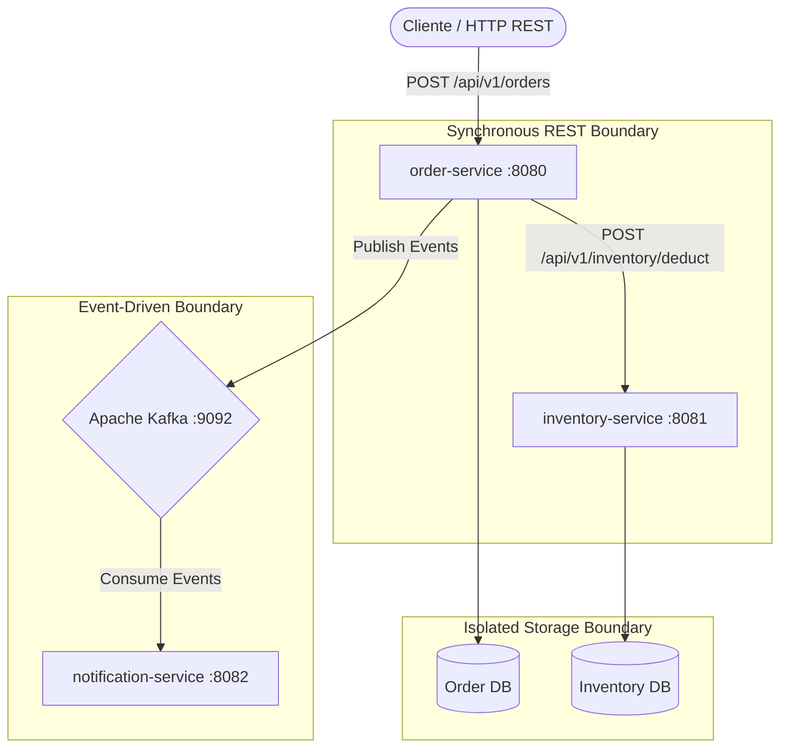
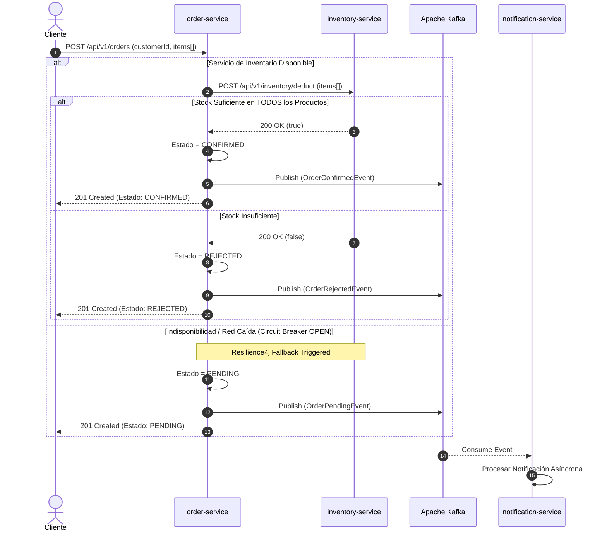
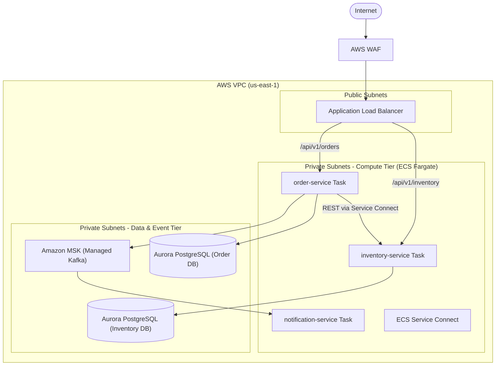
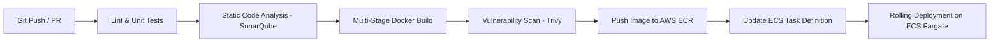

# Arquitectura del Sistema de Gestión de Pedidos e Inventario

## 1. Visión General y Estrategia de Migración
Este sistema representa la primera fase de modernización del monolito logístico hacia una arquitectura orientada a microservicios desacoplados[cite: 6]. Se implementa el patrón **Database per Service**, para garantizar la autonomía de los datos y un enfoque híbrido de comunicación (Síncrono REST para validaciones críticas y Asíncrono **Event-Driven Architecture (EDA)** mediante Kafka para notificaciones y resiliencia) y llamadas atómicas síncronas bajo la filosofía **Domain-Driven Design (DDD)**[cite: 6].

---

## 2. Decisiones Clave de Dominio y Diseño

1. **Natural Key vs. Surrogate Key:**
   * **`productCode` (SKU):** Utilizado exclusivamente como identificador de negocio en contratos de API, DTOs y mensajes de Kafka para evitar el acoplamiento a secuencias internas[cite: 6].
   * **`id` (Long):** Restringido al uso técnico de base de datos como clave primaria relacional (*Surrogate Key*)[cite: 6].

2. **Procesamiento Batch Atómico (All-or-Nothing):**
   * La creación de órdenes admite múltiples productos por solicitud[cite: 6].
   * `inventory-service` procesa la lista de ítems en una única transacción: si algún ítem no posee stock suficiente, la transacción ejecuta un *rollback* completo y la orden se marca como `REJECTED`[cite: 6].

3. **Resiliencia y Fallback:**
   * Las peticiones síncronas entre `order-service` e `inventory-service` están protegidas por **Resilience4j**[cite: 6].
   * Al abrirse el circuito, se guarda el estado como `PENDING` y se emite un evento a Kafka para su posterior reconciliación asíncrona[cite: 6].

---

## 3. Diagramas Lógicos y de Secuencia

### 3.1. Arquitectura Lógica Local (Docker Compose)

---

### 3.2. Diagrama de Secuencia: Flujo "Crear Pedido" con Tolerancia a Fallos

---

## 4. Despliegue Target en la Nube (AWS Architecture)

### 4.1. Diagrama Cloud (AWS VPC)

---

### 4.2. Especificación Detallada de Componentes AWS & Criterios de Selección

#### A. Cómputo y Orquestación: AWS ECS Fargate
* **Criterio de Selección:** Se elige **AWS ECS Fargate** sobre EKS (Kubernetes) para eliminar la sobrecarga operacional de administrar el plano de control y los nodos *worker*[cite: 6]. Ofrece aislamiento a nivel de kernel por contenedor y cobro por segundo exacto de consumo (vCPU y Memoria)[cite: 6].
* **Políticas de Auto Scaling:** Escalado horizontal (*Target Tracking*) configurado para responder dinámicamente a la carga:[cite: 6]
  * Utilización media de CPU > 70%[cite: 6].
  * Utilización media de Memoria > 80%[cite: 6].
  * Concurrencia en ALB > 1,000 peticiones por minuto por réplica[cite: 6].
* **Task Definitions:** Diseñadas bajo el principio de mínimo privilegio, asignando roles IAM específicos por tarea (`Task Role`) y roles de ejecución para descarga de imágenes de ECR e inyección de logs (`Task Execution Role`)[cite: 6].

#### B. Comunicaciones Internas: ECS Service Connect
* **Mecanismo:** Utiliza proxys Envoy de alto rendimiento ejecutados como *sidecars* para gestionar el tráfico Este-Oeste entre microservicios (`order-service` $\rightarrow$ `inventory-service`)[cite: 6].
* **Beneficios:**
  * **Descubrimiento de Servicios:** Resolución DNS privada nativa (ej. `[http://inventory-service.orderinvent.internal:8081](http://inventory-service.orderinvent.internal:8081)`)[cite: 6].
  * **Resiliencia L7:** Balanceo de carga en capa de aplicación con reintentos automáticos, retardo de conexiones e interrupción de circuito a nivel de red[cite: 6].
  * **Telemetría Nivel Red:** Generación automática de métricas de latencia y errores de red sin alterar el código Java/Spring Boot[cite: 6].

#### C. Persistencia Aislada: Amazon Aurora PostgreSQL Serverless v2
* **Criterio de Selección:** Garantiza el cumplimiento del patrón *Database per Service* con auto-escalado instantáneo de 0.5 a 128 ACUs (*Aurora Capacity Units*), ajustándose automáticamente al volumen de transacciones por segundo (TPS)[cite: 6].
* **Alta Disponibilidad:** Despliegue Multi-AZ con réplicas de lectura de baja latencia y conmutación por error (*failover*) automática en menos de 30 segundos[cite: 6].
* **Seguridad y Red:** Ubicadas exclusivamente en subredes privadas aisladas de datos (`Isolated Data Subnets`), inaccesibles desde Internet y con reglas de *Security Groups* que solo permiten tráfico entrante desde las Tareas ECS correspondientes[cite: 6].

#### D. Bus de Eventos: Amazon MSK (Managed Streaming for Apache Kafka)
* **Configuración:** Clúster administrado desplegado en 3 Zonas de Disponibilidad (Multi-AZ) para asegurar cero pérdida de eventos (*Replication Factor = 3*, *min.insync.replicas = 2*)[cite: 6].
* **Estrategia de Particionamiento:** Tópico `order-events` particionado por la clave de negocio (`customerId` o `productCode`) para garantizar la ordenación estricta de mensajes pertenecientes a la misma entidad[cite: 6].
* **Monitoreo de Lag:** Control continuo del *Consumer Group Lag* en `notification-service` para detectar cuellos de botella mediante Prometheus[cite: 6].

#### E. Seguridad de Red e Infraestructura
* **AWS WAF (Web Application Firewall):** Inspección de tráfico web entrante en el Load Balancer para mitigar ataques OWASP Top 10, SQLi, XSS y aplicar *Rate Limiting*[cite: 6].
* **Application Load Balancer (ALB):** Punto de entrada público en `Public Subnets`[cite: 6]. Ejecuta la terminación TLS/SSL (Certificados administrados con AWS Certificate Manager) y enruta el tráfico hacia las subredes privadas[cite: 6].
* **AWS Secrets Manager & KMS:** Cifrado en reposo y en tránsito (TLS 1.3)[cite: 6]. Las credenciales de bases de datos y secretos de Kafka se inyectan dinámicamente como variables de entorno al iniciar cada Tarea ECS[cite: 6].

---

## 5. Pipeline de CI/CD y Estrategia de Despliegue

### 5.1. Flujo del Pipeline (GitHub Actions + AWS ECR / ECS)

### 5.2. Estrategia de Zero Downtime
* **Estrategia Rolling Update:** ECS reemplaza progresivamente las Tareas antiguas manteniendo `minimumHealthyPercent = 100` y `maximumPercent = 200`[cite: 6].
* **Deployment Circuit Breaker:** ECS monitorea los *Health Checks* de las nuevas Tareas[cite: 6]. Si las nuevas instancias fallan, realiza un *Rollback* automático instantáneo a la versión previa estable[cite: 6].

---

## 6. Registros de Decisiones de Arquitectura (ADRs)

### ADR 001: Patrón Database per Service
* **Estado:** Aceptado[cite: 6]
* **Contexto:** Se requiere desacoplar el monolito logístico para permitir que el módulo de pedidos e inventario escalen de forma independiente[cite: 6].
* **Decisión:** Cada microservicio gestiona su propia base de datos de manera aislada[cite: 6]. Se prohíben accesos directos o consultas cruzadas a nivel de BD[cite: 6].
* **Consecuencias:** Garantiza autonomía de despliegue y evita acoplamiento de esquema[cite: 6]. Requiere el uso de APIs REST e integración orientada a eventos (EDA) para consistencia eventual[cite: 6].

### ADR 002: Manejo de Resiliencia mediante Circuit Breaker
* **Estado:** Aceptado[cite: 6]
* **Contexto:** La validación de inventario al crear una orden es una llamada síncrona propensa a fallar si `inventory-service` experimenta latencia o caídas[cite: 6].
* **Decisión:** Integración de Resilience4j en `order-service`[cite: 6]. Ante una interrupción del servicio de inventario, la orden se guarda en estado `PENDING` y se emite un evento a Kafka para garantizar tolerancia a fallos[cite: 6].
* **Consecuencias:** Evita fallos en cascada, protegiendo los hilos del servidor y garantizando que la orden del cliente no se pierda[cite: 6].

### ADR 003: Estandarización del Código SKU (`productCode`)
* **Estado:** Aceptado[cite: 6]
* **Contexto:** Exponer identificadores primarios autogenerados por la base de datos (`id: Long`) genera acoplamiento a la persistencia interna y ambigüedades en sistemas distribuidos[cite: 6].
* **Decisión:** La comunicación externa e inter-servicio se realiza mediante la clave de negocio `productCode` (String)[cite: 6]. El ID numérico se oculta en la capa de infraestructura interna[cite: 6].
* **Consecuencias:** Mejora la semántica de dominio (DDD) y desacopla las APIs externas de la estrategia de claves primarias internas[cite: 6].

### ADR 004: Procesamiento Batch y Verificación Atómica
* **Estado:** Aceptado[cite: 6]
* **Contexto:** Un pedido puede incluir múltiples productos[cite: 6]. Descontar parcialmente el stock de un pedido cuando otro producto no tiene existencias genera datos inconsistentes y problemas logísticos[cite: 6].
* **Decisión:** `inventory-service` expone una interfaz de descuento en lote que evalúa la totalidad del pedido bajo el principio *All-or-Nothing*[cite: 6].
* **Consecuencias:** Previene descuentos parciales e inconsistencias logísticas sin añadir la sobrecarga de transacciones distribuidas complejas (2PC)[cite: 6].

### ADR 005: Selección de AWS ECS Fargate frente a Kubernetes (EKS)
* **Estado:** Aceptado[cite: 6]
* **Contexto:** Evaluación de la plataforma de orquestación de contenedores en AWS para equilibrar flexibilidad, costo y complejidad operativa[cite: 6].
* **Decisión:** Seleccionar AWS ECS Fargate para el cómputo de la plataforma[cite: 6].
* **Consecuencias:** Elimina la complejidad operativa de administrar nodos Kubernetes o clústeres EC2, reduciendo el costo total de propiedad (TCO)[cite: 6].

---

## 7. Observabilidad y Trazabilidad Distribuida

* **Micrometer Tracing:** Inyección automática de variables `traceId` y `spanId` en la cabecera de las peticiones HTTP y metadatos de Kafka para correlacionar logs a través de múltiples microservicios (propagación W3C Standard e integración con AWS X-Ray)[cite: 6].
* **Prometheus Endpoint:** Exposición del endpoint `/actuator/prometheus` en cada microservicio para la recolección de métricas operativas por Prometheus y visualización en Grafana o CloudWatch[cite: 6].
* **Probes de Salud:** Separación de endpoints de diagnóstico (`/actuator/health/liveness` para reinicio del contenedor y `/actuator/health/readiness` para recepción de tráfico) alineados con las políticas de chequeo del Load Balancer (ALB)[cite: 6].
* **Logging Estructurado en JSON:** Salida estándar de logs en formato JSON estructurado utilizando `logback-json-encoder` para ingesta directa en AWS CloudWatch Logs Insights[cite: 6].

---

## 8. Principios de Diseño SOLID y Buenas Prácticas (Spring Boot 3)

1. **Single Responsibility Principle (SRP):**
   * *Separation of Concerns:* `@RestController` (adaptador HTTP y validación), `@Service` (lógica de negocio y orquestación), `@Repository` (persistencia relacional)[cite: 6].
2. **Open/Closed Principle (OCP):**
   * Extensibilidad mediante interfaces y patrones de estrategia (*Strategy Pattern*) para la publicación de eventos y notificaciones sin modificar código existente[cite: 6].
3. **Liskov Substitution & Dependency Inversion (LSP / DIP):**
   * Inyección de dependencias estricta sobre interfaces mediante constructores (`@RequiredArgsConstructor` de Lombok), desacoplando la implementación y facilitando pruebas unitarias con Mocks (*Mockito*)[cite: 6].
4. **Interface Segregation Principle (ISP):**
   * Uso de DTOs específicos desacoplados de las entidades JPA de persistencia, evitando la sobreexposición de datos en la API REST[cite: 6].